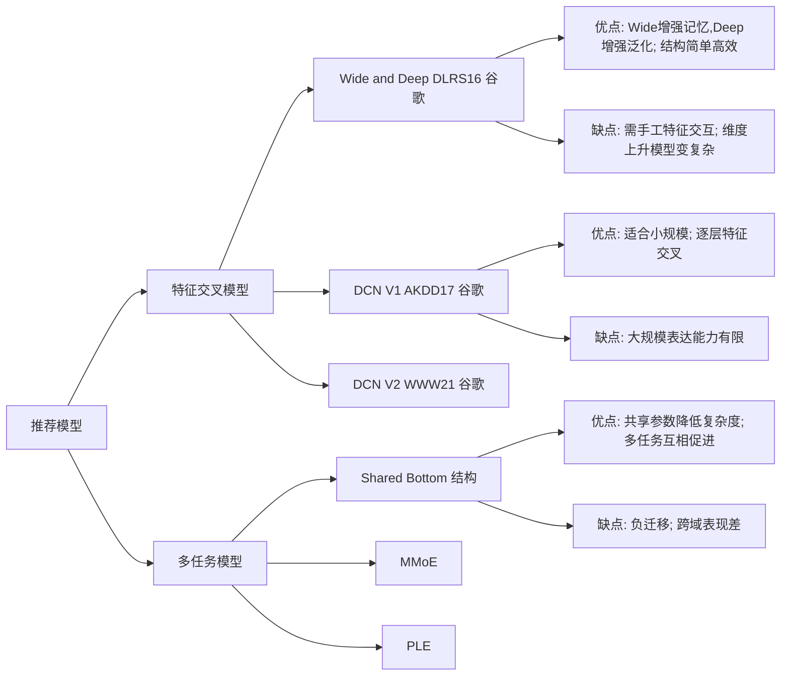

<div align="center">

</div>

<div align="center">
<a href="https://www.python.org/"></a >
<a href="https://pytorch.org/"></a >
<a href="https://www.tensorflow.org/?hl=zh-cn"></a >
<a href="https://blog.csdn.net/qq_41915623/article/details/138839827?fromshare=blogdetail&sharetype=blogdetail&sharerId=138839827&sharerefer=PC&sharesource=qq_41915623&sharefrom=from_link"></a >
<a href="https://juejin.cn/post/7424903278063140898"></a >
<a href="https://www.apache.org/licenses/LICENSE-2.0.html"></a >
</div>
<hr/>

<div align="center">
<a href="https://github.com/Iamctb/EasyDeepRecommand/stargazers"><a/>
</div>


一个通俗易懂的开源推荐系统（A user-friendly open-source project for recommendation systems）.

本项目将结合：**代码、数据流转图、博客、模型发展史** 等多个方面通俗易懂地讲解经典推荐模型，让读者通过一个项目了解推荐系统概况！
非常适合"**新手入门**"、"**阅读推荐相关经典论文**"

持续更新中..., 欢迎star🌟, 第一时间获取更新!!!

## Features

**1️⃣**  分类解析推荐模型：特征交叉模型、多任务模型、行为序列模型等

**2️⃣**  通过blog详细解释模型/论文

**3️⃣**  提供模型发展图：介绍模型的优缺点，解决了什么问题，以及前后因果关系

**4️⃣** 提供详细的代码注释，并包含详细的数据处理模块


## Development of model


和很多朋友交流发现，我们在读很多论文时，都聚焦于论文中提出的模型本身，而没有关心模型间的因果关系，所以这个 **板块用来介绍模型优缺点和模型间的前后因果关系。**

由于很多论文中都没有显式介绍自己模型的优缺点和前因后果，所以很多观点都是本人结合网上资料加上个人理解作出的，如果有不对的地方，欢迎在issue中交流讨论。


## Dataset

| Name   | Preprocess_url                                               | Download                                                     | Progress |
| ------ | ------------------------------------------------------------ | ------------------------------------------------------------ | -------- |
| Criteo | [criteo_preprocess.py](https://github.com/Iamctb/EasyDeepRecommand/blob/main/DataProcess/criteo/criteo_preprocess.py): 预处理源代码 | [Download_URL](https://github.com/reczoo/Datasets/tree/main/Criteo) | ✅ |
|        | [预处理说明](https://github.com/Iamctb/EasyDeepRecommand/blob/main/DataProcess/criteo/readme_about_criteo_preprocess.md) |                                                              |          |


## Model_Zoo

| No.  | Publication | Model      | Blog                                                         | Paper                                                        | Version                                                  |
| ---- | ----------- | ---------- | ------------------------------------------------------------ | ------------------------------------------------------------ | -------------------------------------------------------- |
| 1    | DLRS'16     | WideDeep   | 📝 [WideDeep](https://blog.csdn.net/qq_41915623/article/details/138839827?fromshare=blogdetail&sharetype=blogdetail&sharerId=138839827&sharerefer=PC&sharesource=qq_41915623&sharefrom=from_link) | [Wide & Deep Learning for Recommender Systems](https://arxiv.org/pdf/1606.07792.pdf), **Google** | ✅torch                                                   |
| 2    | ADKDD'17    | DCN        | 📝 [DCN](https://blog.csdn.net/qq_41915623/article/details/145951277?fromshare=blogdetail&sharetype=blogdetail&sharerId=145951277&sharerefer=PC&sharesource=qq_41915623&sharefrom=from_link) | [Deep & Cross Network for Ad Click Predictions](https://arxiv.org/abs/1708.05123), **Google** | ✅torch                                                   |
| 3    | WWW'21      | DCV-v2     | 📝 [DCN-v2](https://blog.csdn.net/qq_41915623/article/details/148999994?fromshare=blogdetail&sharetype=blogdetail&sharerId=148999994&sharerefer=PC&sharesource=qq_41915623&sharefrom=from_link) | [DCN V2: Improved Deep & Cross Network and Practical Lessons for Web-scale Learning to Rank Systems](https://arxiv.org/abs/2008.13535), **Google** | ✅torch                                                   |
| 4    | NeurIPS'23  | TIGER      | 📝 [Tiger](https://blog.csdn.net/qq_41915623/article/details/155646041) | [Recommender Systems with Generative Retrieval](https://arxiv.org/abs/2305.05065), **Google** | [Unofficial Code](https://github.com/XiaoLongtaoo/TIGER) |
| 5    |             | MiniOneRec | 📝[MiniOneRec-RQVAE](https://blog.csdn.net/qq_41915623/article/details/160474397?fromshare=blogdetail&sharetype=blogdetail&sharerId=160474397&sharerefer=PC&sharesource=qq_41915623&sharefrom=from_link)   📝[MiniOneRec-SFT](https://blog.csdn.net/qq_41915623/article/details/160474645?fromshare=blogdetail&sharetype=blogdetail&sharerId=160474645&sharerefer=PC&sharesource=qq_41915623&sharefrom=from_link) | [MiniOneRec: An Open-Source Framework for Scaling Generative Recommendation](https://arxiv.org/abs/2510.24431) | [MiniOneRec](https://github.com/AkaliKong/MiniOneRec)    |


## Dependencies

本项目环境主要有：

- python=3.8.20
- pytorch=1.13.0

其余安装包可以使用下面命令安装：

```
pip install -r requirements.txt
```


## Quick Start

以Criteo数据集和WideDeep举例：

***Step1:***  数据预处理

```python
cd DataProcess/criteo
python criteo_preprocess.py
```

样本数据是使用的Criteo一万条数据作为示例，在执行命令过程中，需要注意 **数据集的路径**

***Step2:*** 训练模型

在 [data_config.json](https://github.com/Iamctb/EasyDeepRecommand/blob/main/ModelZoo/WideDeep/WideDeep_torch/config/data_config.json) 中配置数据集路径；

在 [model_config.json](https://github.com/Iamctb/EasyDeepRecommand/blob/main/ModelZoo/WideDeep/WideDeep_torch/config/model_config.json) 中配置模型信息；

然后运行下面命令即可：

```python
cd ModelZoo/WideDeep/WideDeep_torch
python train.py
```

## 最后
开源项目的一个很大特点就是：**共创！**

欢迎各位在issue中交流讨论。

如果你觉得还不错的话，请帮忙点个star🌟吧，非常感谢！！！
If you think it's good, please help out with a star🌟, thank you !!!
